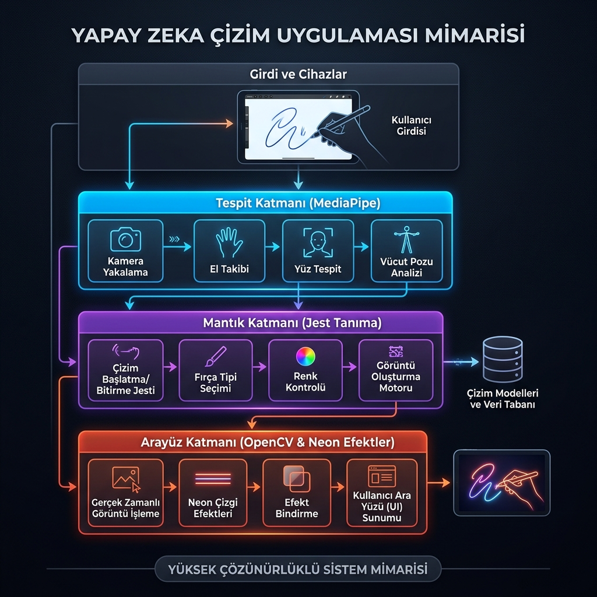

# 📄 Ara Sınav Proje Raporu: Minik Eller Atölyesi

## 1. Giriş

### 1.1. Projenin Amacı ve Kapsamı
**Minik Eller Atölyesi**, okul öncesi dönemdeki çocukların (3-6 yaş) ince motor becerilerini geliştirmeyi ve dijital ortamda sanatsal üretim yapmalarını sağlamayı amaçlayan, yapay zeka (MediaPipe) destekli bir uygulamadır. 

*   **Çözdüğü Problem:** Geleneksel dijital araçlar çocukları pasif ve hareketsiz bir konuma iterken, bu proje çocukların **fiziksel olarak hareket etmesini** zorunlu kılar. Hem ince motor becerilerini (parmak hareketleri) hem de kaba motor becerilerini (vücut hareketleri ile elma yakalama vb.) aktif tutarak teknolojinin getirdiği hareketsizlik problemini kırar.
*   **Kullanıcı Kitlesi:** Okul öncesi çocuklar, anaokulu öğretmenleri ve teknoloji meraklısı aileler.
*   **Sınırlar:** Uygulama şu an için tek kamera üzerinden gerçek zamanlı el takibi yapar ve internet bağlantısı gerektirmeden yerel olarak çalışır.

### 1.2. Motivasyon
Geleneksel boyama kitapları ve dijital boyama uygulamaları arasındaki köprüyü kurmak temel motivasyonumuzdur. Pandemi sonrası dönemde artan ekran süresini, çocukları pasif içerik tüketicisi olmaktan çıkarıp aktif birer sanatçıya dönüştürecek bir "akıllı oyun" haline getirmek istedik. Mevcut dijital oyunların çocukları fiziksel olarak pasifleştirmesine bir alternatif olarak, çocukların kollarını, ellerini ve tüm vücutlarını kullanarak etkileşime girdiği bir ekosistem yaratmayı hedefledik.

---

## 2. Kullanılan Yazılım Araçları ve Teknolojiler

### 2.1. Programlama Dili ve Framework
*   **Python:** Zengin kütüphane desteği (AI, Computer Vision) ve hızlı prototipleme yeteneği nedeniyle ana dil olarak seçilmiştir.

### 2.2. Veritabanı
*   **Yerel Dosya Sistemi (Local Storage):** Projede kullanıcı verilerini saklayan karmaşık bir veritabanı yerine, çocukların yaptığı resimlerin korunması için yerel depolama (PNG formatında kayıt) tercih edilmiştir. Bu, uygulamanın hafif ve taşınabilir olmasını sağlar.

### 2.3. Diğer Araçlar ve Kütüphaneler
*   **OpenCV:** Görüntü işleme, GUI yönetimi ve gerçek zamanlı video akışı için kullanılmıştır.
*   **MediaPipe (Google):** El (Hand) ve Vücut (Pose) takibi için optimize edilmiş, düşük gecikmeli yapay zeka modelleri sunması nedeniyle kritik öneme sahiptir.
*   **NumPy:** Matris tabanlı çizim işlemleri ve veri manipülasyonu için kullanılmıştır.

### 2.4. Geliştirme Ortamı ve Versiyon Kontrolü
*   **IDE:** Visual Studio Code (VSC).
*   **Versiyon Kontrol:** Git & GitHub.
*   **Repo Linki:** [https://github.com/A-s-i-y-e/MinikEller_Atolyesi](https://github.com/A-s-i-y-e/MinikEller_Atolyesi)

---

## 3. Sistem Mimarisi ve Teknik Tasarım

### 3.1. Genel Mimari
Uygulama **Katmanlı Mimari (Layered Architecture)** prensiplerini takip eder:
1.  **Detection Layer (Tespit Katmanı):** Kamera verisini alır, MediaPipe kullanarak el ve vücut landmark'larını çıkarır.
2.  **Logic Layer (Mantık Katmanı):** Çıkarılan landmark'ları yorumlayarak "Çiz", "Sil" veya "Seç" gibi jestleri belirler.
3.  **UI/Rendering Layer (Arayüz Katmanı):** OpenCV kullanarak neon efektleri, parçacık sistemleri ve kullanıcı arayüzünü ekrana basar.

---

## 4. Uygulamanın İşlevselliği

### 4.1. Temel Özellikler ve Kullanıcı Senaryoları

#### 4.1.1. Özellik: El Jesti ile Serbest Çizim
**Açıklama:** Kullanıcı sadece işaret parmağını (☝️) havaya kaldırarak ekranda farklı renklerde çizim yapabilir. Yapay zeka, parmağın ucunu 1280x720 çözünürlüğünde takip eder.

#### 4.1.2. Özellik: Sihirli Şablon Boyama
**Açıklama:** Ekranda beliren hazır şablonların (Araba, Ayı vb.) üzerine gelip parmağıyla dokunan çocuk, o alanı taşırmadan otomatik olarak boyar. Bu özellik çocukların başarı hissini artırır.

#### 4.1.3. Özellik: Eğitici Oyunlar (Balon Patlatma ve Elma Yakala)
**Açıklama:** El koordinasyonunu geliştirmek için ekrandaki balonları parmakla dokunarak patlatma ve vücut hareketleriyle düşen elmaları toplama oyunlarıdır.

---

## 5. Kod Kalitesi ve Yazılım Geliştirme Pratikleri

### 5.1. Kod Organizasyonu ve Okunabilirlik
Proje modüler bir dosya yapısına sahiptir:
*   `main.py`: Ana uygulama döngüsü ve state yönetimi.
*   `hand_detector.py`: Yapay zeka çıkarım modülü.
*   `canvas.py`: Çizim ve katman yönetimi.
*   `ui_engine.py`: Parçacık efektleri ve görsel iyileştirmeler.

Kodlar, Python'un PEP8 standartlarına uygun olarak yazılmış; fonksiyon ve değişken adları ("draw_neon_text", "get_stable_gesture") okunabilirliği artıracak şekilde seçilmiştir.

---

## 6. Sonuç ve Gelecek Çalışmalar

### 6.1. Elde Edilen Sonuçlar
Proje başlangıcında hedeflenen "temassız çocuk atölyesi" vizyonuna ulaşılmıştır. Uygulama, modern bilgisayarlarda 30+ FPS ile akıcı bir şekilde çalışmakta ve el hareketlerini milisaniyeler içinde algılayabilmektedir. Tüm temel çizim, silme ve oyun özellikleri başarıyla test edilmiştir.

### 6.2. Karşılaşılan Zorluklar ve Sınırlılıklar
*   **Işıklandırma:** Kameranın bulunduğu ortamdaki çok düşük veya çok parlak ışık, el tespit başarısını %10-%15 oranında düşürebilmektedir. Bu sorun, görüntüye uygulanan otomatik parlaklık dengelemesi ile büyük oranda çözülmüştür.
*   **Kamera Açısı:** Çocukların kameraya çok yakın olması durumunda elin tüm landmark'larının kare dışına çıkması takibi zorlaştırmaktadır.

### 6.3. Geliştirme Önerileri
1.  **Çoklu Oyuncu:** İki çocuğun aynı anda farklı ellerle aynı tuvalde çizim yapabilmesi.
2.  **Sesli Komut:** "Kırmızı kalem al" gibi sesli komutlarla araç değiştirme desteği.
3.  **Mobil Entegrasyon:** Uygulamanın Android/iOS tabletlerde de çalışabilecek şekilde port edilmesi.
