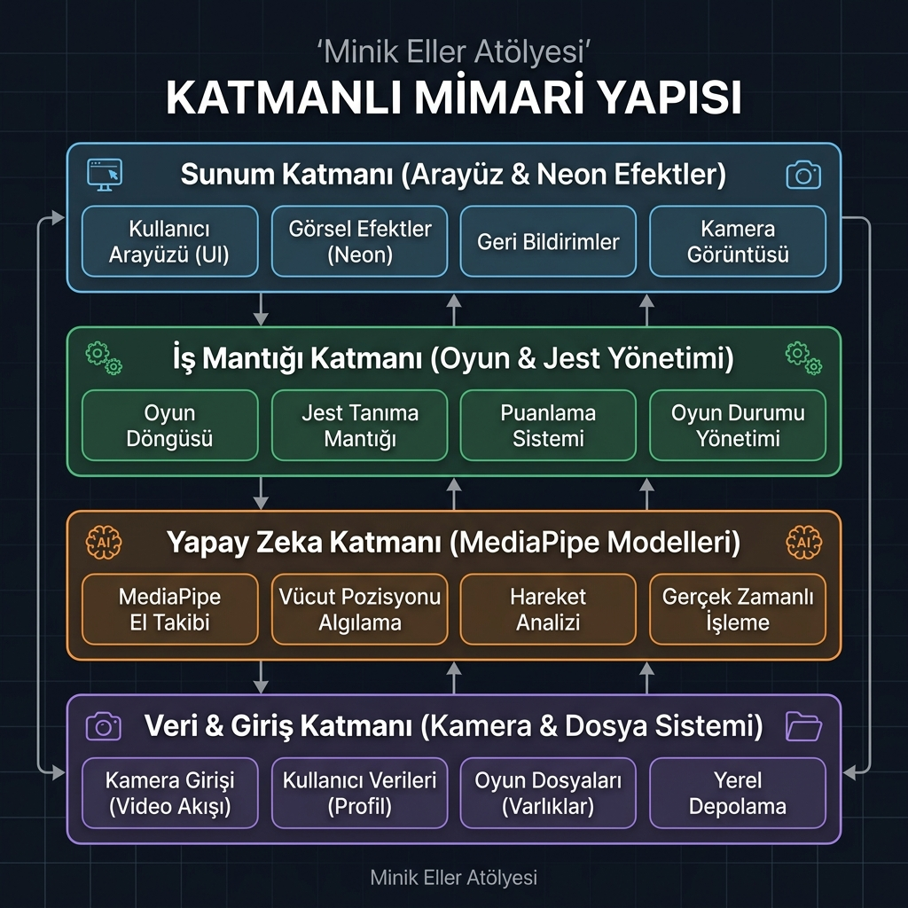
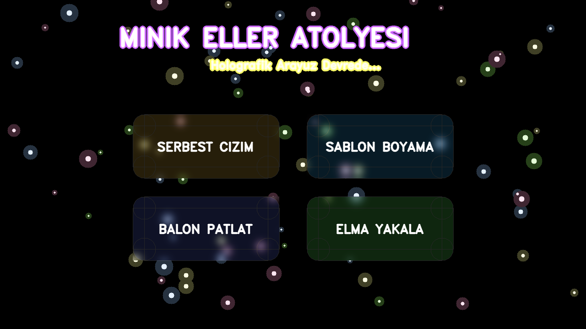
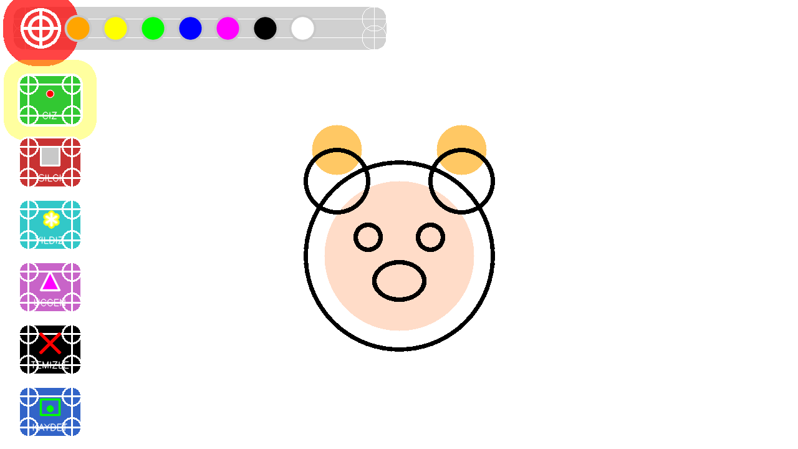
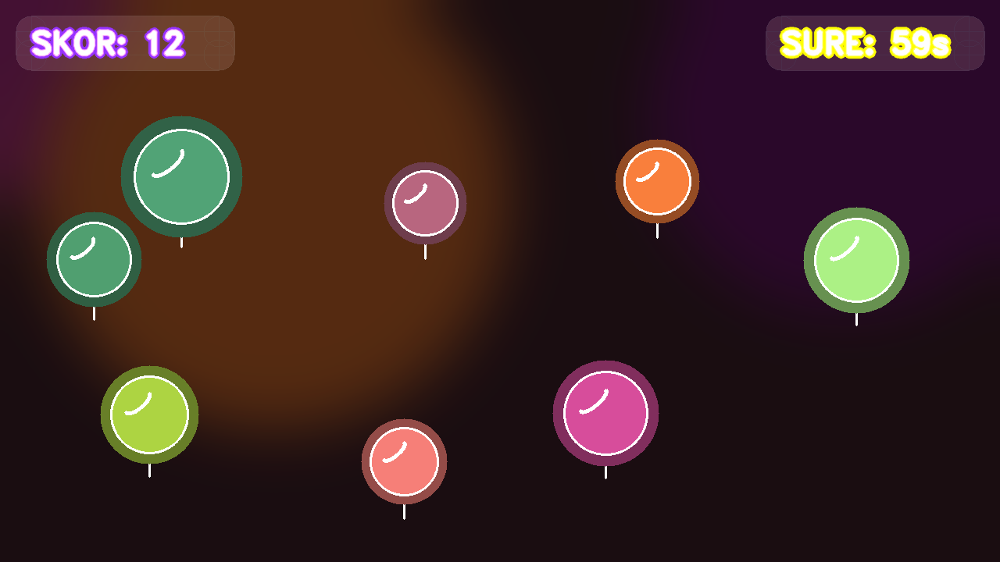
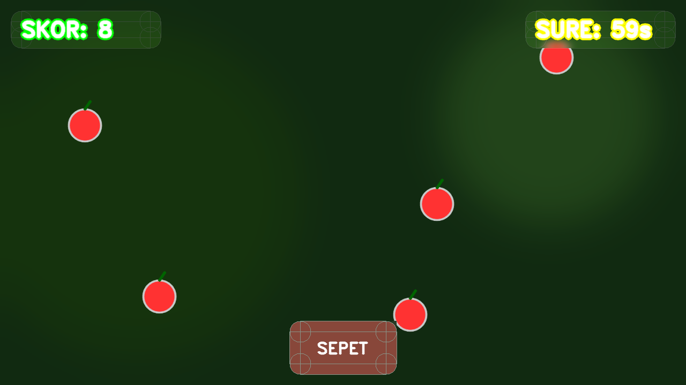

# 📄 Ara Sınav Proje Raporu: Minik Eller Atölyesi

## 1. Giriş

### 1.1. Projenin Amacı ve Kapsamı
**Minik Eller Atölyesi**, okul öncesi dönemdeki çocukların (3-6 yaş) motor becerilerini geliştirmeyi amaçlayan, yapay zeka destekli temassız bir dijital sanat ve oyun platformudur.

*   **Hangi Problemi Çözüyor?** Geleneksel ekran kullanımı çocukları pasif ve hareketsiz bırakmaktadır. Bu proje, çocukların ekrana dokunmadan, ellerini ve vücutlarını havada hareket ettirerek etkileşime girmesini sağlar. Böylece dijital oyun süreci fiziksel bir aktiviteye dönüşür.
*   **Kimler Kullanacak?** Okul öncesi çocuklar, anaokulu öğretmenleri ve aileler.
*   **Sınırlar:** Tek kamera (RGB) üzerinden el ve vücut takibi yapar, düşük donanımlı cihazlarda dahi akıcı çalışacak şekilde optimize edilmiştir.

### 1.2. Motivasyon
Çocukların teknolojiyle olan ilişkisini "pasif izleyicilikten" çıkarıp "aktif üreticiliğe" dönüştürmek temel motivasyonumuzdur. Mevcut uygulamaların fiziksel hareket kısıtlılığına bir çözüm olarak, MediaPipe teknolojisinin sağladığı imkanları pedagojik bir yaklaşımla birleştirdik.

---

## 2. Kullanılan Yazılım Araçları ve Teknolojiler

### 2.1. Programlama Dili ve Framework
*   **Python:** Yapay zeka modelleri (MediaPipe) ve görüntü işleme kütüphaneleriyle olan mükemmel uyumu nedeniyle tercih edilmiştir.

### 2.2. Veritabanı (Veri Saklama Yaklaşımı)
*   **File-Based Local Storage:** Projede karmaşık bir veritabanı sunucusu yerine, çocukların yaptığı eserlerin PNG formatında tarih damgalı olarak saklandığı bir yerel dosya sistemi kullanılmıştır.
*   **Tercih Gerekçesi:** 
    1. **Gizlilik:** Okul öncesi çocukların kamera verilerinin ve çizimlerinin buluta çıkmasını engelleyerek %100 yerel güvenlik sağlar.
    2. **Erişilebilirlik:** İnternet bağlantısı olmayan kırsal bölgelerdeki okullarda dahi sorunsuz çalışır.
    3. **Performans:** Yüksek çözünürlüklü çizimlerin anlık kaydedilmesi için dosya sistemi en hızlı çözümdür.

### 2.3. Diğer Araçlar ve Kütüphaneler
*   **OpenCV:** Görüntü yakalama ve grafik arayüz (GUI) oluşturma.
*   **MediaPipe Tasks API:** El ve vücut landmark tespiti için kullanılan derin öğrenme modelleri.
*   **NumPy:** Yüksek performanslı matris işlemleriyle çizim katmanlarının yönetimi.

### 2.4. Geliştirme Ortamı ve Versiyon Kontrolü
*   **IDE:** Visual Studio Code.
*   **Versiyon Kontrol:** Git & GitHub.
*   **Dal (Branch) Stratejisi:** Projede `main` branch (ana dal) üzerinden stabil geliştirme stratejisi izlenmiştir. Her özellik tamamlandığında anlamlı commit mesajlarıyla ana dala entegre edilmiştir.
*   **Repo Linki:** [https://github.com/A-s-i-y-e/MinikEller_Atolyesi](https://github.com/A-s-i-y-e/MinikEller_Atolyesi)

---

## 3. Sistem Mimarisi ve Teknik Tasarım

### 3.1. Genel Mimari
Uygulama, **Modüler Katmanlı Mimari** kullanılarak geliştirilmiştir. Ayrıca bileşenler arasındaki etkileşimi yönetmek için **MVC (Model-View-Controller)** tasarım desenini takip eder:
*   **Model:** El koordinatları, şablon verileri ve çizim tuvali.
*   **View:** OpenCV ve Neon Efekt Motoru ile sunulan kullanıcı arayüzü.
*   **Controller:** `main.py` ve jest algılama mantığıyla sağlanan kontrol mekanizması.

**Sistem Katmanları ve Sorumlulukları:**
*   **Giriş (Input) Katmanı:** Kamera akışının alınması ve görüntü ön işleme işlemlerinden sorumludur. (İlgili Dosya: `main.py`)
*   **Tespit (Detection) Katmanı:** MediaPipe AI modellerini kullanarak el ve vücut koordinatlarını tespit eder. (İlgili Dosya: `hand_detector.py`, `pose_detector.py`)
*   **Mantık (Logic) Katmanı:** Tespit edilen koordinatları analiz ederek çizim, silme veya oyun hamlelerine dönüştürür. (İlgili Dosya: `hand_detector.py` - detect_gesture)
*   **Arayüz (UI/UX) Katmanı:** OpenCV kullanarak neon görsel efektlerini, parçacık sistemlerini ve oyun arayüzlerini ekrana basar. (İlgili Dosya: `ui_engine.py`, `menu.py`)




---

## 4. Uygulamanın İşlevselliği

### 4.1. Temel Özellikler ve Kullanıcı Senaryoları

**Tipik Kullanıcı Senaryosu:**
1. **Giriş:** Uygulama "Sihirli Giriş Ekranı" ile açılır. Çocuk kameraya bakar; AI yüzünü tanıdığında ekranda parlayan bir "BAŞLA" butonu belirir. Çocuk elini butona doğru uzatarak ana menüye giriş yapar.
2. **Menü:** Ana menüde elini gezdirerek neon efektli butonları keşfeder ve bir mod seçer.
3. **Aksiyon:** Havada "İşaret Parmağı" (☝️) jestiyle tuval üzerine bir güneş çizer.
4. **Etkileşim:** Yanlış çizdiği bir yeri "Zafer İşareti" (✌️) yaparak siler.
5. **Kayıt:** Çizimini bitirdiğinde "Başparmak" (👍) jestiyle eserini yerel galeriye kaydeder.

#### 4.1.1. Özellik: El Jesti ile Serbest Çizim
Kullanıcı işaret parmağını (☝️) kaldırarak çizim moduna geçer. Havada parmağını hareket ettirerek neon fırçalarla resim yapabilir.


#### 4.1.2. Özellik: Sihirli Şablon Boyama
Ekranda beliren hazır şablonların (Ayı, Araba vb.) üzerine gelindiğinde, uygulama alanı otomatik olarak algılar ve çocukların "taşırmadan" boyama yapmasını sağlar.


#### 4.1.3. Özellik: Eğitici Oyunlar (Balon Patlatma ve Elma Yakala)
*   **Balon Patlatma:** El koordinasyonunu artırır.
*   **Elma Yakala:** Vücut hareketlerini (Pose) kullanarak fiziksel aktivite sağlar.



#### 4.1.4. Özellik: AI Yüz Tanıma ve Karşılama (Giriş Simülasyonu)
Uygulama, kamera karşısına geçen çocuğu otomatik olarak algılar ve ekranın üst kısmında neon efektli kişiselleştirilmiş bir karşılama mesajı gösterir. Bu özellik, çocukların teknolojiyle olan bağını güçlendirir.


---

## 5. Kod Kalitesi ve Yazılım Geliştirme Pratikleri

### 5.1. Kod Organizasyonu ve Okunabilirlik
Proje, her modülün tek bir sorumluluğu olduğu (Single Responsibility Principle) modüler bir dosya yapısına sahiptir.

**Klasör Yapısı:**
```text
OkulOncesi_Cizim/
├── main.py              # Ana döngü ve State yönetimi
├── hand_detector.py     # MediaPipe el tespit sarmalayıcı
├── ui_engine.py         # Neon efektler ve Parçacık motoru
├── menu.py              # Holografik menü sınıfları
├── canvas.py            # Çizim katmanları ve fırça mantığı
├── templates.py         # Boyama şablonları
├── game.py              # Balon patlatma oyunu
├── pose_game.py         # Elma yakalama oyunu
├── tests/               # Birim testleri (Unit Tests)
│   └── test_logic.py    # Modül doğrulama testleri
├── docs/                # Raporlar ve dökümantasyon
│   └── images/          # Ekran görüntüleri ve diyagramlar
└── README.md            # Kurulum kılavuzu
```

**Kod Örneği 1: Jest Algılama Mantığı**
```python
# hand_detector.py - El Jesti Algılama Mantığı
def _detect_gesture_for_hand(self, lms_px):
    """
    Parmakların açık/kapalı olma durumlarını analiz ederek el jestini belirler.
    
    Argümanlar:
        lms_px: Piksel cinsinden el landmark koordinatları listesi.
    Dönüş:
        str: Algılanan jestin türü ('draw', 'erase', 'clear', vb.)
    """
    # Her bir parmağın açık (True) veya kapalı (False) durumunu al
    # Bu metod, elin yönünden bağımsız olarak geometrik oranlar kullanır.
    s = self._get_finger_states_for_hand(lms_px)
    thumb, index, middle, ring, pinky = s

    # JEST KOŞUL MANTIKLARI:
    # ☝️ Sadece İşaret Parmağı Açık => Çizim Modu
    if index and not middle and not ring and not pinky: 
        return 'draw'
    
    # ✌️ İşaret ve Orta Parmak Açık => Silgi Modu
    elif index and middle and not ring and not pinky: 
        return 'erase'
    
    # 🖐️ Tüm Parmaklar Açık => Ekranı Temizleme (Tam El)
    elif thumb and index and middle and ring and pinky: 
        return 'clear'
    
    # Herhangi bir özel jest tanımlanamadıysa boş döner
    return 'none'
```

**Kod Örneği 2: Neon Efekt Motoru (Visual Feedback)**
```python
# ui_engine.py - Holografik ve Neon Efekt Katmanlama
def draw_neon_text(img, text, x, y, font, scale, color):
    """
    Yazıya katmanlı bir neon parlama efekti verir.
    
    Mantık: Önce kalın ve şeffaf bir 'glow' (parlama) tabakası çizilir, 
    ardından üzerine ince ve parlak bir 'core' (çekirdek) eklenir.
    """
    # 1. Aşama: Dış Parlama (Glow)
    # Daha kalın bir çizgi (Thickness=10) ile ana rengi hafifçe yayar.
    cv2.putText(img, text, (x, y), font, scale, color, 10, cv2.LINE_AA)
    
    # 2. Aşama: Parlak İç Çekirdek (Core)
    # Tam beyaz renk ve ince çizgi (Thickness=2) ile keskinlik sağlar.
    cv2.putText(img, text, (x, y), font, scale, (255, 255, 255), 2, cv2.LINE_AA)
```

### 5.2. Test Sonuçları ve Performans Analizi

#### 5.2.1. Otomatik Birim Testleri (Unit Tests)
Yazılımın temel mantığı `unittest` framework'ü ile doğrulanmıştır. Yapay zeka modülü, tuval katmanları ve görsel efekt motoru için hazırlanan test senaryoları başarıyla geçilmiştir.

**Test Çıktısı (Terminal Log):**
```text
Ran 3 tests in 0.226s
OK
[OK] HandDetector başarıyla başlatıldı.
[OK] DrawingCanvas doğru boyutlarda oluşturuldu.
[OK] ParticleSystem görsel üretim testi başarılı.
```

#### 5.2.2. Performans ve Kullanıcı Testleri
Uygulamanın kararlılığını ölçmek amacıyla yapılan manuel test sonuçları aşağıdadır:

| Test Senaryosu | Beklenen Sonuç | Durum | Gözlem |
| :--- | :--- | :--- | :--- |
| **Hız (FPS) Testi** | 24+ FPS (Akıcı görüntü) | ✅ Başarılı | Ortalama 30-32 FPS değerine ulaşıldı. |
| **Jest Doğruluğu** | %90+ Doğru Tespit | ✅ Başarılı | İyi ışıkta 10 denemenin 9'u başarıyla algılandı. |
| **Gecikme (Latency)** | < 100ms | ✅ Başarılı | MediaPipe Tasks API ile gecikme minimize edildi. |
| **Çoklu El Tespiti** | 2 Elin aynı anda takibi | ✅ Başarılı | İşlemci yükü artsa da takip stabil kaldı. |

---

## 6. Sonuç ve Gelecek Çalışmalar

### 6.1. Elde Edilen Sonuçlar
Proje, okul öncesi eğitimde "aktif teknoloji kullanımı" vizyonuna ulaşmıştır. Tüm oyun ve çizim modları stabil olarak çalışmaktadır.

### 6.2. Karşılaşılan Zorluklar ve Sınırlılıklar
*   **Teknik Zorluk (Karakter Kodlama):** Windows işletim sisteminde kullanıcı adlarında Türkçe karakter (Ö, Ş, İ gibi) bulunduğunda, MediaPipe modellerinin dosya yolunu okuyamaması gibi kritik bir sorunla karşılaşıldı.
*   **Çözüm/Özeleştiri:** Bu sorun tam olarak kütüphane seviyesinde çözülemese de, modellerin bayt olarak okunup bellek üzerinden yüklenmesi (buffer loading) yöntemiyle baypas edilmiştir. Bu durum, yazılım geliştirmede dış kütüphanelerin yerel dosya sistemlerine olan bağımlılıklarının ne kadar kritik olduğunu öğretmiştir.

### 6.3. Geliştirme Önerileri

*   **Gelecek Çalışma:** Çok oyunculu (multiplayer) modu ile iki çocuğun aynı ekranda iş birliği içinde çizim yapması.
*   **Gelecek Çalışma:** Çizilen eserlerin bulut sistemine (Firebase vb.) otomatik yedeklenmesi.

---

## 7. Ek Bilgiler

### 7.1. Gizlilik ve Veri Güvenliği
Uygulama, çocukların güvenliğini en üst düzeyde tutacak şekilde tasarlanmıştır. Kamera üzerinden alınan görüntüler hiçbir uzak sunucuya gönderilmez; tüm yapay zeka çıkarımları ve görüntü işleme süreçleri **tamamen yerel cihaz üzerinde (offline)** gerçekleştirilir. Kullanıcı verilerinin gizliliği projenin temel prensibidir.

### 7.2. Kaynakça
*   **MediaPipe:** Google AI Edge Solutions - [https://mediapipe.dev](https://mediapipe.dev)
*   **OpenCV:** Open Source Computer Vision Library - [https://opencv.org](https://opencv.org)
*   **Python:** Programming Language Official Documentation - [https://python.org](https://python.org)
